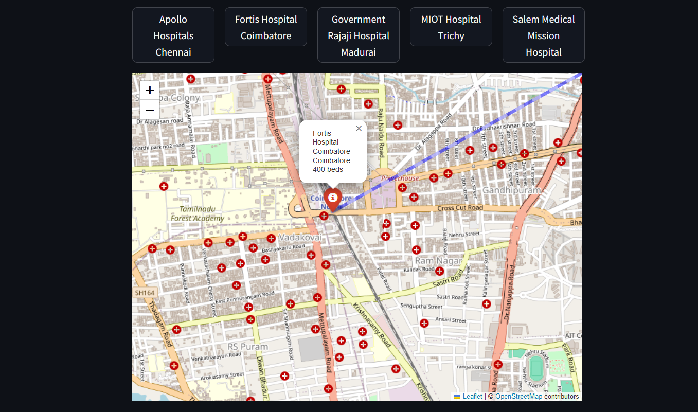

🚀Check out the configuration reference at https://huggingface.co/docs/hub/spaces-config-reference

🚀Huggingface Spaces : https://huggingface.co/spaces/prithivMLmods/Medcial-Map-NearMe

🚀Docs for Space : https://huggingface.co/spaces/prithivMLmods/Medcial-Map-NearMe/tree/main

🗺️Map showing Fortis Hospital in Coimbatore & it's bed count availability [400]

🔮Nearby Hospitals to Fortis Hospital Coimbatore :

.

.

.

## Package dependencies

+streamlit
+graphviz
+pycountry
+folium
+streamlit-folium
+altair<5

pip install -r requirements.txt

Run the app by : python streamlit run app.py
